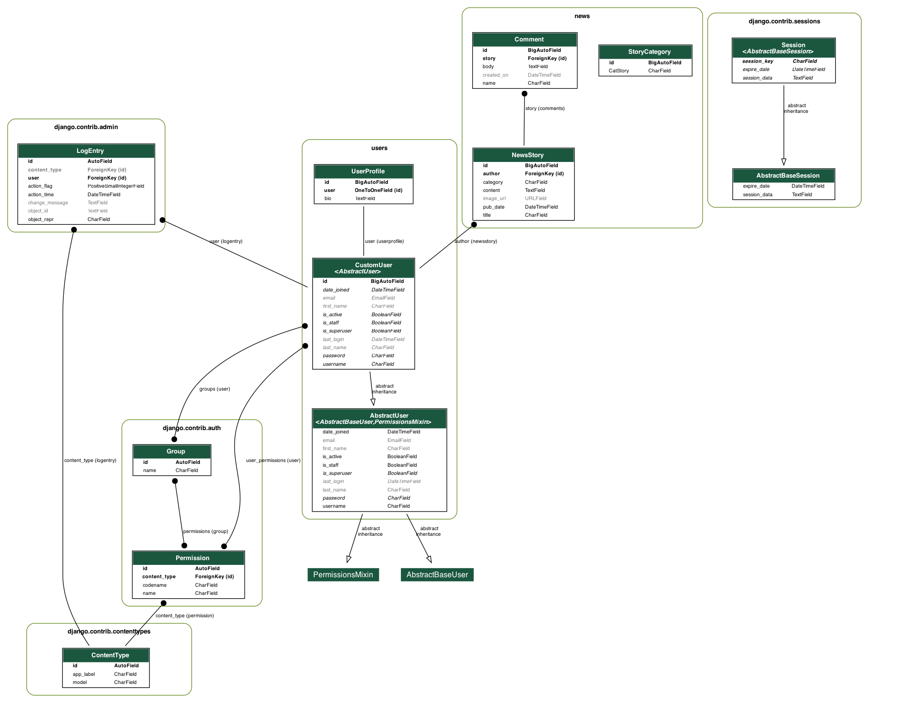

Karla Gaudet - She Codes News Project

## About This Project
Our brief was to create a news website for She Codes Australia that allows users to read news stories, and authors to create them.

## How To Run This Code
1. _Clone the repo to your local machine_ - Navigate to the directory of your choice and run the following command:

    * `git clone [https://github.com/ktechgau/she_codes_news]`

2. _Set up Virtual Environment_ - In your terminal, navigate to the folder containing requirements.txt file:

    * Mac run the following command: `source ./venv/bin/activate`
    * Windows run the following command: `venv/Scripts/activate`

3. Install Django, Migrate, Load Data and Run:

    * `python3 -m pip install -r requirements.txt`
    * `python3 -m pip freeze` (to check if install successful)
    * `cd she_codes_news` (to navigate to where `manage.py` file is contained)
    * `python3 manage.py migrate to make migrations`
    * `python3 manage.py loaddata news` (to load the data for the articles)
    * `python3 manage.py runserver` (to run the server)

3. View the She Codes News site: http://localhost:8000/news

## Databse Schema

## Features

#### [View Features Video (Youtube Channel)](https://youtu.be/RX3jeoCbZSg?si=45XF_6zFRwvr34W_)
### 

### Compulsory Features:

- [x] Order the stories by date

- [x] Style the form for adding new stories.

- [x] Add a field to the NewsStory model for an image url and use this image url rather
than the default images provided in the starter
- [x] Show/Hide relevant information/buttons on whether the user is logged in/out
- [x] Enable/Disable relevant features based on whether the user is logged in/out

### _Facilitated Feature: Creating a Users app:_
- [x] Functional login/logout buttons
- [x] Account view so authors can see their profile information
- [x] Create Account functionality, so a new user can sign up to be an author
- [x] View stories by a particular author

### Additional Features implemented:

- [x] Ability to update and delete stories (permissions considered)
- [x] Time set of story published instead of just the date
- [x] Ability to comment on stories
- [x] User Profiles include stories they have written, ability to update and delete profile details

#### Future Developments:

Here are some features yet to be implemented:
* "Delete" function for user accounts
* Search/filter by story categories
* "Likes" function
* Keyword Search

